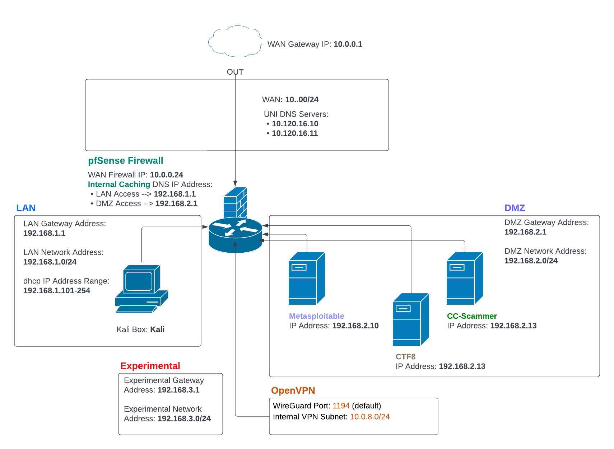
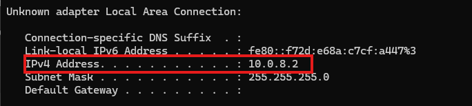
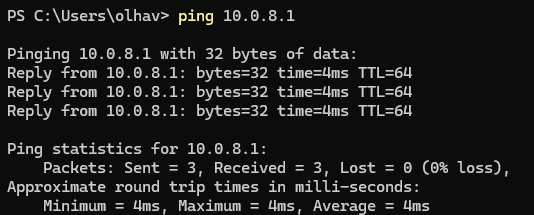
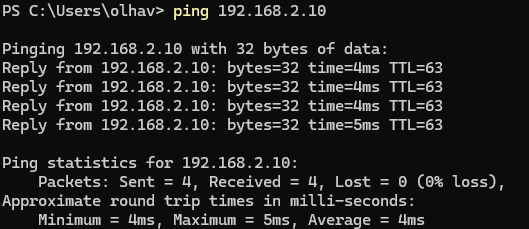

# Spring 2025 UNISEC Pentesting Exercise

## Network Topology
### ProxMox Hypervisor
The ProxMox Server under the IP: **134.161.78.43** hosts the following machines:
- pfSense Firewall
    * IP Address: **10.0.0.24/24**
    * LAN Subnet: **192.168.1.0/24**
    * DMZ Subnet: **192.168.2.0/24**
    * Experimental Subnet: **192.168.3.0/24**
    * OpenVPN Subnet: **10.0.8.0/24**
- "Metasploitable" Server: **192.168.2.10**
- "CTF8" Server: **192.168.2.13**
- "CC-Scammer" Server: **192.168.2.17**
- Kali Box: **LAN DHCP**

In order to allow external connections to the OpenVPN service running on pfSense, **iptables** was used on the Proxmox host to port forward UDP traffic from **134.161.78.43:1194** to the internal pfSense IP **10.0.0.24:1194**.
- Uses the DNAT (Destination NAT) function of iptables.

### Network Diagram
<div align="center">
  
</div>

## Get Started
### Download the .ovpn file
In order to connect to the internal subnets on the ProxMox server, you have to connect using OpenVPN. Download the necessary file [HERE](./unisec-dom.ovpn).

Username: **unisec**  
Password: **unisec**

This OpenVPN configuration utilizes **Split Tunneling**. This means that traffic directed to the Proxmox internal subnets is routed through the VPN tunnel into pfSense, while traffic destined for external sources, such as google.com, is routed through the client's regular network interface.

### Test Connection
#### Check your IP configuration  
Windows:
```bash
ipconfig
```

Linux:  
```bash
ip a
```

Sample Output:  
<div align="center">
  
</div>

You should be assigned an ip address in the **10.0.8.0/24** subnet.  

#### Test internal connection by pinging the VPN gateway: 10.0.8.1
```bash
ping 10.0.0.8.1
```

Sample Output:
<div align="center">
  
</div>

#### Lastly, test connection to DMZ Pentesting servers:  
```bash
# Metasploitable Server
ping 192.168.2.10
```

Sample Output:  
<div align="center">
  
</div>


