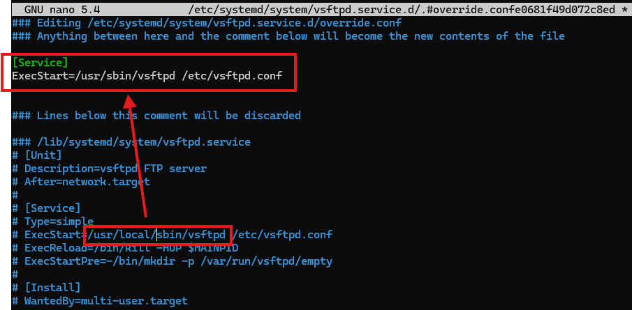
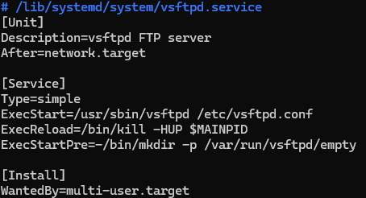
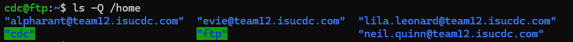
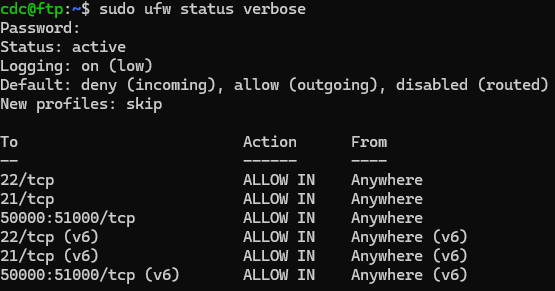

# vsftpd Configuration for ICDC 2025


## vsftpd Version Upgrade
The folks over at ISU thought it would be super funny to install the vsftpd service without the use of a package manager. Without the use of a package manager, you cannot upgrade the existing software :(  

This gave me the opportunity to do some extra stuff to get the newest version of vsftpd via the apt package manager and get the system to execute the newly installed binaries.

Regardless of how vsftpd is installed, run the following commands to get the latest version:
```bash
sudo apt update
sudo apt-get upgrade vsftpd
```

Now check the system service file for vsftpd to make sure it is pointing to the correct binary to start the service:
```bash
sudo systemctl edit vsftpd
```

Example: Changed ExecStart from **/usr/local/sbin/vsftpd** (old binary) to **/usr/sbin/vsftpd** (new binary)

<div align="center">
  
</div>

Verify the changes were made:
```bash
sudo systemctl cat vsftpd
```

Example Output:

<div align="center">
  
</div>

Finalize changes and restart the service:
```bash
sudo systemctl revert vsftpd
sudo systemctl daemon-reexec
sudo systemctl restart vsftpd
```


## Create an FTP upload directory for FTP Users
You want to create a directory for just ftp uploads for efficient organization and security. I created the upload directory named **ftp** for each user on the ftp server.

Create a bash script to generate the ftp directories:

```bash
# Create the Script File
nano create_ftp_dirs.sh

# Script below:

#!/bin/bash

echo "Current users in /home:"
ls -Q /home  # List all home directories with quotes

# Loop through each directory in /home safely
for user in /home/*; do
    user=$(basename "$user")  # Extract the directory name
    if id "$user" &>/dev/null; then  # Check if it's a valid system user
        USER_GROUP=$(id -gn "$user")  # Get the user's primary group

        # Create ftp directory in user's home if it doesn't exist
        sudo mkdir -p "/home/$user/ftp"

        # Set ownership: user and their group
        sudo chown "$user":"$USER_GROUP" "/home/$user/ftp"

        # Set permissions: rwx for user/group, rx for others
        sudo chmod 775 "/home/$user/ftp"

        echo "Created FTP directory for $user with user ownership and user group ($USER_GROUP)"
    fi
done

```

Make the script executable:
```bash
chmod +x create_ftp_dirs.sh
```

Run the script:
```bash
./create_ftp_dirs.sh
```


## vsftpd.conf 
You will want to change the configuration file for vsftpd to lock users to the upload directory you just created. You will also want to point vsftpd to put users in that directory after ftp login.

Edit the vsftpd.conf file:
```bash
sudo nano /etc/vsftpd.conf
```

Sample vsftpd.conf file:
```conf
# vsftpd config file /etc/vsftpd.conf
#
# READ THIS: This example file is NOT an exhaustive list of vsftpd options.
# Please read the vsftpd.conf.5 manual page to get a full idea of vsftpd's
# capabilities.
anonymous_enable=NO
local_enable=YES
write_enable=YES
local_umask=022
anon_upload_enable=NO
xferlog_enable=YES

# You may fully customize the login banner string:
ftpd_banner=Cyber Print FTP service for INTERNAL USE ONLY.

listen=YES

# Competition Additions --------------------------------------------------------
listen_port=21

# Opening a range of ports for outgoing connections
pasv_enable=YES
pasv_min_port=50000
pasv_max_port=51000

# Setting the default directory for file uploads to be /home/$USER/ftp
# WARNING: Make sure each user has a /home/$USER/ftp directory
user_sub_token=$USER
local_root=/home/$USER/ftp

# Makes it so users can have a custom file designating their default directory on their profile!
user_config_dir=/etc/vsftpd/user_conf

# Locks FTP users to the specified upload directory
chroot_local_user=YES

# Allows the upload directory to be writeable
allow_writeable_chroot=YES

# -------------------------------------------------------------------------------

```


## Personalized vsftpd user configuration 
For some users, you will need to add an extra configuration file to designate their default upload directory.    

For the 2025 ICDC competition I had to manually add these files to users joined through the AD (since they had domain names) with custom home directory names!

Check users on the server with home directories:
```bash
ls -Q /home
```

Example Output:

<div align="center">
  
</div>

Make the user configuration file:
```bash
sudo mkdir -p /etc/vsftpd/user_conf
sudo nano /etc/vsftpd/user_conf/[ssh_username]

# Example:
sudo nano /etc/vsftpd/user_conf/lila.leonard
```

Sample user configuration file:
```conf
local_root=/home/lila.leonard@team12.isucdc.com/ftp
chroot_local_user=YES
```


## inotify and System Process Setup
What is **inotify**?   
*inotify* is a Linux kernel subsystem that provides a way for applications to monitor changes to files and directories. It allows programs to receive notifications when files or directories are modified, accessed, created, or deleted. This is useful for tasks like:
* Monitoring log files for new entries
* Watching directories for file uploads or changes
* Synchronizing file systems
* Automating tasks based on file changes   

Install inotify:
```bash
sudo apt update
sudo apt install inotify-tools -y
```

You can create a bash script that will be used to constantly scan the ftp upload directory for all users and restrict uploaded files.    

The bash script below will be used to restrict file uploads to only **.stl** files.

Create a real time monitoring script:
```bash
sudo nano /usr/local/bin/ftp-file-monitor.sh
```

Sample Script:
```bash
#!/bin/bash

WATCH_DIR="/home/*/ftp"
LOG_FILE="/var/log/file_monitor.log"

# Ensure the log file exists
touch "$LOG_FILE"

# Ensure inotifywait is installed
if ! command -v inotifywait &>/dev/null; then
    echo "Error: inotify-tools is not installed. Install it using: sudo apt install inotify-tools" | tee -a "$LOG_FILE"
    exit 1
fi

# Find all FTP directories under /home/* and watch them
WATCH_DIRS=()
for dir in /home/*/ftp; do
    if [ -d "$dir" ]; then
        WATCH_DIRS+=("$dir")
    fi
done

# Check if there are directories to watch
if [ ${#WATCH_DIRS[@]} -eq 0 ]; then
    echo "Error: No FTP directories found in /home/*/ftp." | tee -a "$LOG_FILE"
    exit 1
fi

echo "Monitoring directories: ${WATCH_DIRS[*]}" | tee -a "$LOG_FILE"

# Start monitoring files in FTP directories
inotifywait -m -r -q -e close_write -e moved_to --format "%w%f" "${WATCH_DIRS[@]}" | while read FILE
do
    sleep 1  # Small delay to ensure complete file write

    # Check if the file is an STL file
    if [[ "$FILE" != *.STL && "$FILE" != *.stl ]]; then
        echo "$(date): Deleting non-STL file: $FILE" | tee -a "$LOG_FILE"
        rm -f "$FILE"
        continue
    fi

    # Check file content type using 'file' command
    FILE_TYPE=$(file -b "$FILE")

    # If the output does not contain "data", delete the file
    if [[ ! "$FILE_TYPE" =~ data ]]; then
        echo "$(date): Deleting STL file with incorrect format ($FILE_TYPE): $FILE" | tee -a "$LOG_FILE"
        rm -f "$FILE"
    else
        echo "$(date): Valid STL file detected: $FILE" | tee -a "$LOG_FILE"
    fi
done
```

Make the script executable:
```bash
sudo chmod +x /usr/local/bin/ftp-file-monitor.sh
```

Add a systemd service unit to manage the script as a **background service** (I named my service "ftp-file-monitor"):
```bash 
sudo nano /etc/systemd/system/ftp-file-monitor.service
```

Sample Service File:
```conf
[Unit]
Description=Monitor FTP uploads and delete non-txt files
After=network.target

[Service]
User=root
ExecStart=/usr/local/bin/ftp-file-monitor.sh
Restart=always

[Install]
WantedBy=multi-user.target
```

Finalize the process:
```bash
sudo systemctl daemon-reload
sudo systemctl restart ftp-file-monitor
sudo systemctl enable ftp-file-monitor
sudo systemctl start ftp-file-monitor
sudo systemctl status ftp-file-monitor
```

## ufw Setup

```bash
# Allow SSH (port 22)
sudo ufw allow 22/tcp

# Allow FTP (port 21)
sudo ufw allow 21/tcp

# Allow passive FTP data transfer (ports 50000-51000)
sudo ufw allow 50000:51000/tcp

# Enable UFW (if not already enabled)
sudo ufw enable

# Refresh UFW
sudo ufw reload

# Check the status to verify the rules
sudo ufw status verbose
```

Example Output:

<div align="center">
  
</div>

# Fail2Ban Setup

Create a local fail2ban config file:
```bash
# The default configuration file is located at /etc/fail2ban/jail.conf, but you should avoid editing this file directly to prevent losing changes during updates.
sudo cp /etc/fail2ban/jail.conf /etc/fail2ban/jail.local
```

Edit the local file's [sshd] sectipn:
```bash
sudo nano /etc/fail2ban/jail.local
```

Sample jail.local file:
```conf
[sshd]

# To use more aggressive sshd modes set filter parameter "mode" in jail.local:
# normal (default), ddos, extra or aggressive (combines all).
# See "tests/files/logs/sshd" or "filter.d/sshd.conf" for usage example and details.
mode   = ddos
enabled = true
port    = ssh
filter = sshd
logpath = %(sshd_log)s
backend = %(sshd_backend)s
maxretry = 5
# 10 Minute Ban Time
bantime = 600
# 5 minute window for retries
findtime = 300
# Bans all ports on the offending machine for 10 minutes
banaction = iptables-allports
```

Restart the service:
```bash
sudo systemctl restart fail2ban
sudo fail2ban-client status # check service status 
sudo fail2ban-client status sshd # check jail status
```

Congrats, you should be able to have a fully working FTP server with restrictions on file uploads!


